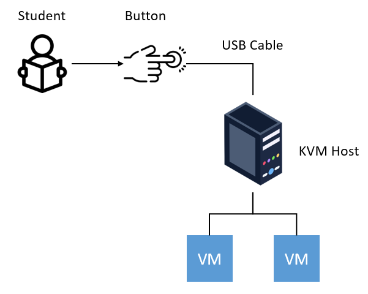
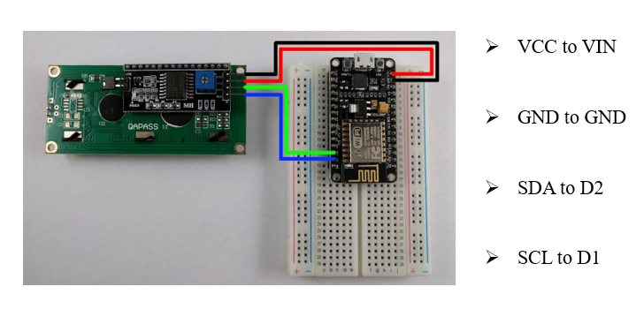
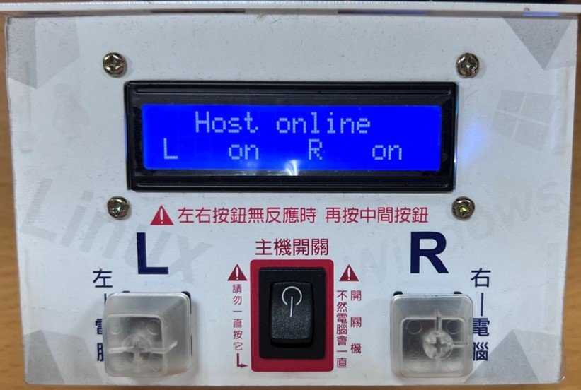
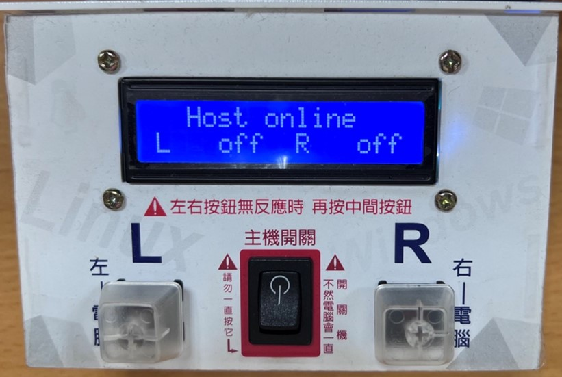
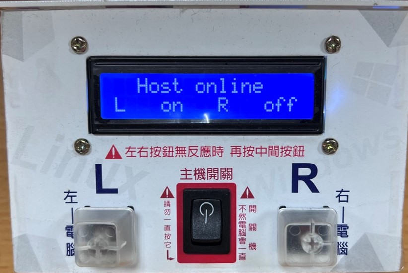
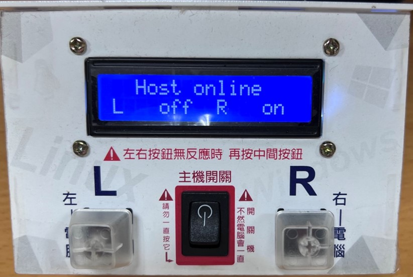

## 專案名稱
單晶片控制虛擬機器啟動系統

## 專案介紹
除了部署虛擬機器之外，啟動虛擬機器也是一項繁瑣的過程。由於部份學生尚未修過Linux相關課程，而且並非每個人都擁有KVM Host的管理員帳號，為了解決上述問題，特別開發了此系統，以方便系上同學上課。

## 目錄和檔案說明
- **script：** 涵蓋許多腳本，主要功能包括device偵測、狀態更新、VM的開機腳本和一些有關PCI(e) Passthrough的東西。

- **control.ino：** 運行在ESP8266上，當使用者觸發按鈕時，將控制GPIO傳遞value至Linux系統，並透過外接LCD顯示狀態畫面。

- **daemon.service：** 顧名思義就是運行在Linux系統上的daemon（為此系統提供服務），主要運行script/welcome.py。

- **images：**：一些demo相關的圖片和影片。

> [!NOTE]
> 部份腳本可能因伺服器種類不同，若直接下載可能無法正常運行。

## 專案架構
當學生點擊整合了NodeMCU和LCD的按鈕盒子後，系統將控制GPIO的High Low並傳遞value至KVM Host，以啟動VM。

| 系統架構 | NodeMCU與LCD連接圖 |
| --- | --- |
|  |  |

## Demo圖片和影片
| VM均開啟 | VM均未啟動 |
| --- | --- |
|  |  |

| 左邊VM開啟 | 右邊VM開啟 |
| --- | --- |
|  |  |

https://github.com/wshimin613/Single-Chip-Control/assets/83169038/2f2dd093-073c-44ca-9f8f-a2eec0ae0b42

